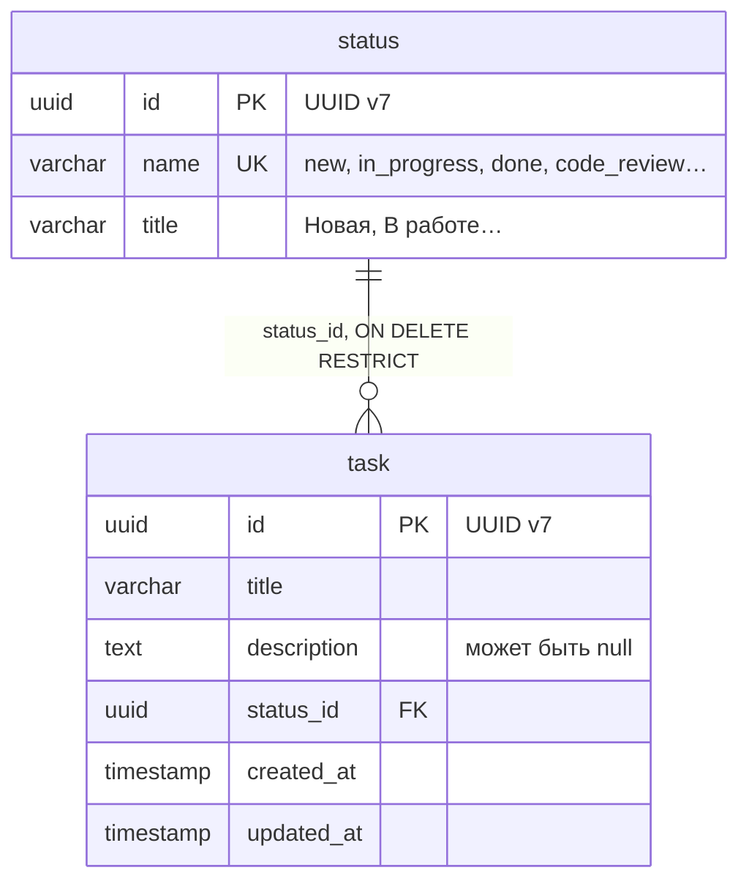
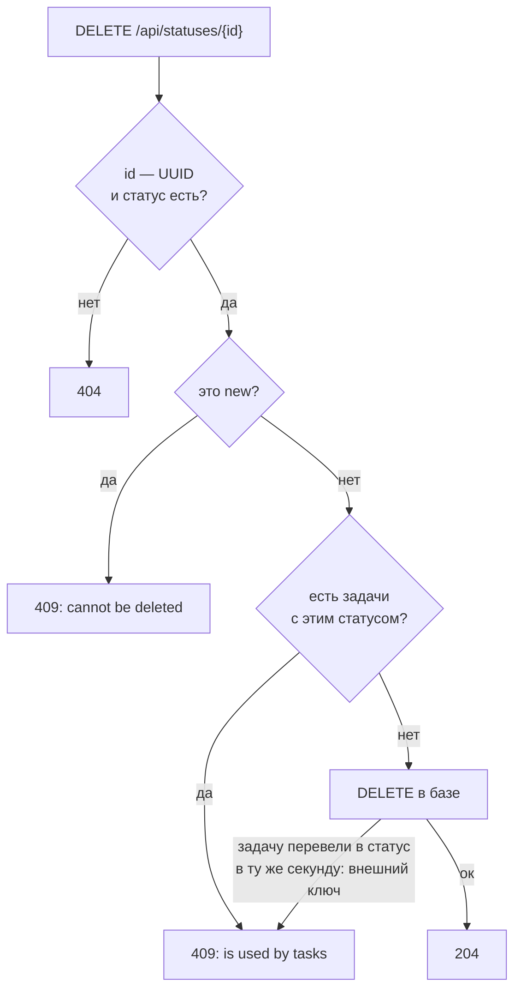
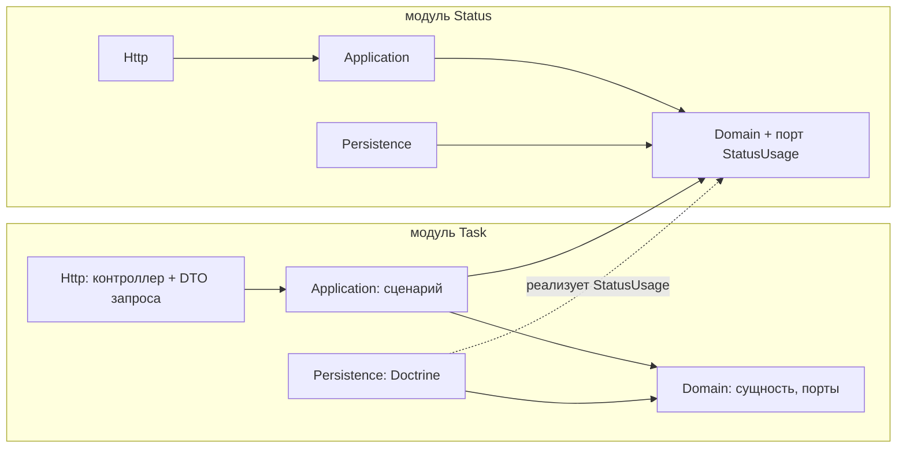
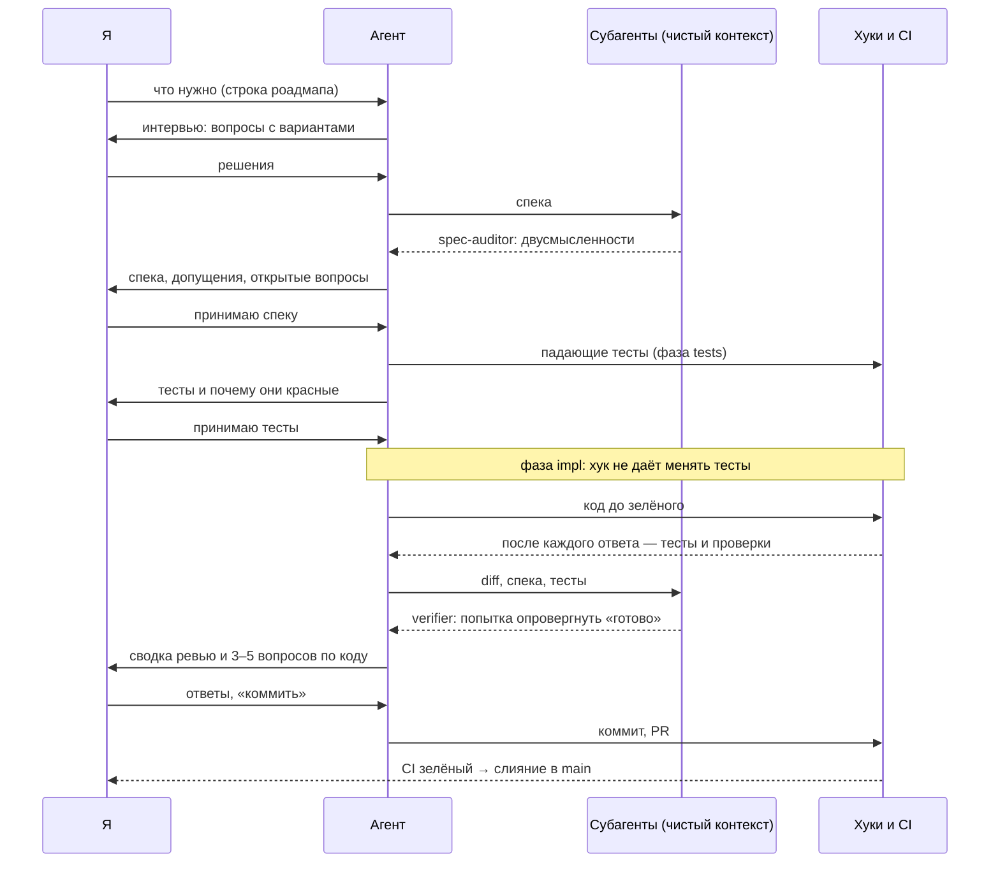
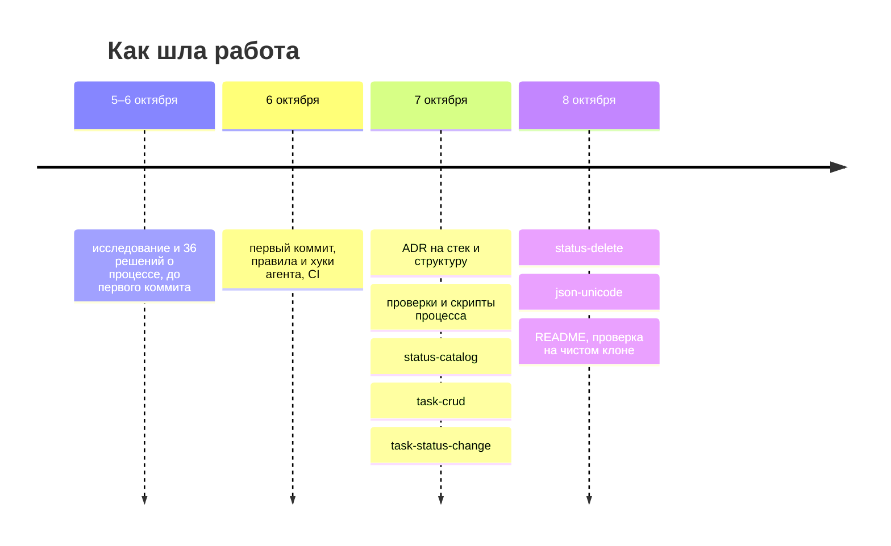

# Task Manager API — REST API для задач и их статусов

[](https://github.com/rikire/task-manager-api/actions/workflows/ci.yml)
[](https://github.com/rikire/task-manager-api/actions/workflows/ci.yml?query=branch%3Amain)
[](https://github.com/rikire/task-manager-api/actions/workflows/ci.yml?query=branch%3Amain)
[](docs/adr/ADR-0001-platform-versions.md)
[](docs/adr/ADR-0001-platform-versions.md)
[](docs/adr/ADR-0001-platform-versions.md)
[](phpstan.neon)
[](docs/api/openapi.yaml)
[](phpstan-complexity.neon)
[](deptrac.yaml)
[](psalm.xml)
[](commitlint.config.mjs)

Тестовое задание Skyeng (Backend): REST API для задач и статусов на Symfony 8.1, PHP 8.4, PostgreSQL 18 и
Docker Compose. Сделано всё обязательное: каталог статусов (список, чтение, создание, удаление) и задачи
(создание, чтение, список с фильтром по статусу, смена статуса, удаление); из дополнительных пунктов —
коды ответов, OpenAPI, строгая валидация, PHPUnit, DTO и правила для ИИ-агента; кэш и очереди — нет.

Код писал ИИ-агент Claude Code, решения принимал я. Поэтому в репозитории два проекта: API и процесс
разработки с агентом — он описан в [приложении](#как-устроен-процесс-разработки-с-агентом).

**Маршрут для проверки:** [как запустить](#как-запустить) →
[архитектурные решения](#архитектурные-решения-и-компромиссы) → [неоднозначности задания](#где-задание-можно-понять-по-разному)
→ код в [`src/`](src/) ([карта](#карта-кода)) → [что дальше](#что-дальше) →
[использование ИИ](#использование-ии) → [время](#сколько-времени-ушло).

## Как запустить

Нужны git и Docker с Compose v2 (amd64 или arm64).

```sh
git clone https://github.com/rikire/task-manager-api.git
cd task-manager-api
docker compose up -d
```

Первый запуск собирает образ приложения — около двух минут. Миграции применяются сами при старте.
Проверка: `docker compose ps` — `db` и `app` в состоянии running, `migrate` завершился с кодом 0.
Остановить: `docker compose down` (с удалением данных — `down -v`).

- API: <http://localhost:8080>
- Swagger UI и контракт OpenAPI: <http://localhost:8080/api/doc> (JSON — `/api/doc.json`, копия в
  репозитории — [docs/api/openapi.yaml](docs/api/openapi.yaml))
- Порт 8080 занят — `cp .env.example .env` и поменяйте `HTTP_PORT`.
- Тесты: `make test` (нужны только Docker и make; поднимает стек для разработки).

### Попробовать API

```sh
# Создать задачу → 201, статус new
curl -s -i -X POST http://localhost:8080/api/tasks -H 'Content-Type: application/json' \
  -d '{"title": "Подготовить отчет", "description": "Отчет по продажам за май"}'
```

```json
{"id":"01a11a52-38c9-7117-a9d6-15af78e7b2a0","title":"Подготовить отчет","description":"Отчет по продажам за май",
 "status":"new","created_at":"2026-10-08T07:02:38Z","updated_at":"2026-10-08T07:02:38Z"}
```

```sh
# Перевести в done → 200 (id — из ответа выше)
curl -s -i -X PATCH http://localhost:8080/api/tasks/<id>/status -H 'Content-Type: application/json' \
  -d '{"status": "done"}'

# Задачи со статусом done → 200, {"items": [...]}
curl -s -i 'http://localhost:8080/api/tasks?status=done'

# Удалить статус done, пока на нём есть задача → 409
curl -s -i -X DELETE http://localhost:8080/api/statuses/019b76da-a800-7000-8000-000000000003
```

```json
{"type":"https:\/\/tools.ietf.org\/html\/rfc2616#section-10","title":"An error occurred","status":409,
 "detail":"Status \"done\" is used by tasks."}
```

Все эндпоинты с ошибками (битый JSON, лишнее поле, несуществующий id и статус) —
[docs/api/curl-examples.md](docs/api/curl-examples.md).

| Метод и путь | Что делает |
|---|---|
| `GET /api/statuses` | список статусов |
| `GET /api/statuses/{id}` | один статус |
| `POST /api/statuses` | создать статус: `{"name": "code_review", "title": "Ревью кода"}` |
| `DELETE /api/statuses/{id}` | удалить статус: 409, если его используют задачи, и всегда для `new` |
| `GET /api/tasks` | список задач; фильтр `?status=<name>` |
| `GET /api/tasks/{id}` | одна задача |
| `POST /api/tasks` | создать задачу: `{"title": "…", "description": "…"}`, `description` необязательно; статус — `new` |
| `PATCH /api/tasks/{id}/status` | сменить статус: `{"status": "done"}` |
| `DELETE /api/tasks/{id}` | удалить задачу |

## Архитектурные решения и компромиссы

### 1. Задача ссылается на статус внешним ключом, в API статус — по имени



Задача не может остаться со статусом, которого нет, — это держит PostgreSQL, а не код. В запросах и ответах
статус — его `name` (`"status": "done"`, `?status=done`), как в примерах задания. Статусы — пополняемый
каталог: `new`, `in_progress`, `done` создаёт миграция, новая задача получает `new`
([ADR-0007](docs/adr/ADR-0007-api-conventions.md)).

### 2. Статус, который используют задачи, удалить нельзя — 409



Ничего не удаляется и не меняется неявно. Отвергнутые варианты — перевести задачи в `new` или удалить их
вместе со статусом: оба меняют или теряют данные, о которых клиент не просил. `new` удалить нельзя никогда:
его получает каждая новая задача. Модуль статусов спрашивает «используют ли статус задачи» через интерфейс
`StatusUsage`, а внешний ключ — последний рубеж на случай гонки
([ADR-0007](docs/adr/ADR-0007-api-conventions.md), D2).

### 3. Структура: два модуля, в каждом — ядро без фреймворка и папка на сценарий



Стрелка — «зависит от». Домен не знает о Symfony и Doctrine и ходит в базу через интерфейсы (порты),
которые реализует `Persistence`. Status не зависит от Task: вопрос «есть ли задачи с этим статусом» Status
задаёт через свой порт `StatusUsage`, а отвечает модуль Task. Правила слоёв проверяет Deptrac в CI: контроллер,
который полезет в базу, не пройдёт сборку.

Цена — больше файлов, интерфейсы с одной реализацией, XML-мэппинг Doctrine вместо атрибутов. Для девяти
эндпоинтов это избыточно; я выбрал этот вариант, а не более лёгкий, который рекомендовал агент, —
[вписать автору: почему] ([ADR-0006](docs/adr/ADR-0006-module-structure.md),
[обзор архитектуры](docs/architecture/README.md)).

### 4. Строгий ввод, ошибки — JSON с понятным кодом

| Ситуация | Код |
|---|---|
| битый JSON | 400 |
| неверное значение, лишнее поле, несуществующий статус в `PATCH` или `?status=` | 422 |
| несуществующий id; id не UUID, в том числе UUID в верхнем регистре | 404 |
| имя статуса занято; статус используется или это `new` | 409 |

Тело ошибки — problem details (RFC 9457): `status`, `detail`, для валидации — список `violations` с полем и
текстом. Поля `type` и `title` пока заполняет Symfony по умолчанию (`…rfc2616#section-10`, `An error
occurred`) — см. [что дальше](#что-дальше). Неизвестные query-параметры игнорируются: их добавляют прокси и
браузеры. UUID в верхнем регистре — 404: маршрут принимает только строчную форму, а путь, который не похож на id,
не называет ресурс ([ADR-0005](docs/adr/ADR-0005-validation.md), [ADR-0007](docs/adr/ADR-0007-api-conventions.md)).

### 5. Одновременная запись в одну задачу не защищена

При двух одновременных `PATCH` побеждает последний; `PATCH`, совпавший с `DELETE`, может ответить 200 уже
удалённой задаче; два одновременных `DELETE` одного статуса могут оба ответить 204. Задание гарантий при
параллельной записи не требует, а защита — версия строки и 409 при конфликте — меняет схему.

### 6. Что сознательно упрощено

Нет пагинации, авторизации и админки — задание их исключает. Нет редактирования статуса — такого эндпоинта в
задании нет. Списки упорядочены по id: UUID v7 растёт со временем, поэтому это порядок создания.

### Карта кода

```text
src/
├── Task/                          модуль задач
│   ├── Domain/                    сущность Task, исключения, порты (интерфейсы репозиториев)
│   ├── Application/CreateTask/    сценарий: команда CreateTask + CreateTaskHandler
│   │   …ChangeTaskStatus, DeleteTask, GetTask, ListTasks
│   └── Infrastructure/
│       ├── Http/CreateTask/       CreateTaskController + CreateTaskRequest (DTO с валидацией)
│       └── Persistence/           Doctrine: репозиторий, XML-мэппинг, DoctrineStatusUsage
├── Status/                        модуль статусов — так же: Create, Delete, Get, List
└── Shared/Infrastructure/Http/    общее для API: ошибки в JSON, кодировка ответов
tests/
├── Functional/                    HTTP-запрос → ответ и база, по эндпоинту на файл
├── Task/, Status/, Shared/        тесты адаптеров базы и инфраструктуры
└── Architecture/                  правила слоёв (Deptrac)
migrations/                        две миграции: статусы с начальными значениями, задачи
```

## Где задание можно понять по-разному

Задание просит в таких местах выбрать разумный вариант и описать его. Варианты и разбор — в
[ADR-0007](docs/adr/ADR-0007-api-conventions.md) (развилки D1–D5) и спеках
[задач](openspec/specs/tasks/spec.md) и [статусов](openspec/specs/statuses/spec.md).

| Вопрос | Что выбрано | Почему |
|---|---|---|
| Какой статус у новой задачи? Задание не говорит | всегда `new`; поле `status` в теле создания — лишнее, 422 | [вписать автору: почему] |
| Как задача хранит статус? | внешний ключ на `status.id`; в API — `name` | целостность держит база даже при гонке; `name` — как в примерах задания |
| Что делать при удалении используемого статуса? | 409, ничего не удаляется | перенос или каскад молча меняют данные клиента |
| Каким может быть `name` статуса? | `^[a-z][a-z0-9_]*$`, до 50 символов, уникален; повтор — 409 | все примеры задания такие (`code_review`); `name` — идентификатор в URL и теле |
| Форма списка? | `{"items": [...]}` | пагинации нет, но обёртка позволит добавить `total` без поломки клиентов |
| Несуществующий статус в `?status=` или в `PATCH`? | 422 с `detail` `Unknown status "x".` | пустой список скрыл бы опечатку |
| Лишнее поле в теле? Неизвестный query-параметр? | поле — 422; параметр игнорируется | поле клиент прислал сам, параметры добавляют прокси и браузеры |
| Ограничения на переходы статусов? | нет: из любого в любой; тот же статус повторно — 200 без изменений | задание правил переходов не задаёт; статусы — пополняемый каталог без порядка |

[вписать автору: если где-то причина была другой или выбор делал не я, а агент по умолчанию, — поправить
строку.]

## Что дальше

Что добавил бы за пару дней:

- **Кэш списка статусов** (дополнительные баллы задания) — одно изменение и ADR о том, когда сбрасывать кэш.
- **Свои `type` и `title` в ошибках** вместо значений Symfony по умолчанию (`IMP-016` в
  [реестре](docs/registers/debt.md)).
- **Защита от одновременной записи** — версия строки и 409 при конфликте.
- **Мелкий долг**: правило имени статуса записано в трёх DTO (`IMP-012`); нет записи в лог, когда гонку при
  удалении статуса ловит внешний ключ (`IMP-014`).
- **Перед реальным деплоем** — контейнеры не от `root` (`IMP-002`); порог мутационного тестирования в CI
  (`IMP-008`).

Что сделал бы иначе:

- Процесс строил раньше продукта и с запасом: решения о процессе, хуки и проверки заняли 15–18 часов из
  20–24, продукт — около 5 ([время](#сколько-времени-ушло)). [вписать автору: что из процесса окупилось, а
  что оказалось лишним.]
- Сбоев агента записано 12 ([реестр](docs/registers/failures.md)); меры к ним — от строчки в инструкции до
  хука, который блокирует действие. Например, обход запрета через запись файла из shell (FAIL-004) закрыл хук, а
  продуктовую работу до конца инициализации (FAIL-005) — проверка порядка роадмапа. [вписать автору: вывод.]

## Использование ИИ

Код, тесты и документацию писал ИИ-агент Claude Code. Я решал: требования, контракт API и коды ошибок,
схема данных, архитектура, зависимости; принимал спеки, тесты и каждый коммит. Коммиты с агентом помечены
трейлером `Assisted-by: Claude Code`. [вписать автору: читал ли каждый дифф кода или выборочно.]

Как устроено одно изменение и где что проверяется:



**Пример — удаление статуса** (изменение [`status-delete`](openspec/changes/archive/2026-10-08-status-delete/)):

1. Задание: удалить статус и проверить, что будет с задачами (строки 93–95 и 136).
2. Варианты — 409, перенос задач в `new`, каскадное удаление; я выбрал 409
   ([ADR-0007](docs/adr/ADR-0007-api-conventions.md), D2).
3. Требование со сценариями — [спека статусов](openspec/specs/statuses/spec.md), `REQ-STATUS-delete`;
   по замечанию `spec-auditor` я добавил сценарий гонки.
4. Тесты до кода: [`DeleteStatusTest`](tests/Functional/Status/DeleteStatusTest.php) и тест гонки в
   [`DoctrineStatusRepositoryTest`](tests/Status/Infrastructure/Persistence/DoctrineStatusRepositoryTest.php).
5. Тест гонки нашёл настоящий дефект: PostgreSQL сообщает о нарушении `ON DELETE RESTRICT` кодом 23001,
   который Doctrine не распознаёт, — без исправления гонка давала бы 500.
6. Код — [`DeleteStatusHandler`](src/Status/Application/DeleteStatus/DeleteStatusHandler.php), порт
   [`StatusUsage`](src/Status/Domain/StatusUsage.php); коммит `3caad9e`; сводка ревью —
   [`review.md`](openspec/changes/archive/2026-10-08-status-delete/review.md).

Что держит машина, а что — только правило:

| Риск | Чем закрыт |
|---|---|
| агент подгоняет тесты под код | хук блокирует правку тестов в фазах `impl` и `refactor`; запись через shell хук ловит не во всех формах — тогда держит моя проверка диффа |
| агент коммитит, пушит, меняет зависимости, миграции или свои инструкции | permissions Claude Code: каждое такое действие спрашивает меня |
| агент пропускает проверки | `--no-verify` запрещён; всё, что проверяет pre-commit, повторяет CI, а слить в `main` можно только с зелёным CI |
| агент решает за меня | только правило в [AGENTS.md](AGENTS.md); нарушения записаны в реестр сбоев |

Песочница Claude Code на этой машине выключена (`DEBT-001`), поэтому shell-команды агента не изолированы;
известные обходы защит — [.claude/hooks/BYPASSES.md](.claude/hooks/BYPASSES.md).

## Сколько времени ушло



Около 20–24 часов, из них **продукт — около 5**:

- исследование и решения о процессе до первого коммита — около 5 часов (моя оценка);
- после первого коммита, по меткам времени коммитов: процесс — 10–13 часов, продукт (пять изменений с
  интервью, тестами и ревью) — около 5 часов; разброс — от того, какой разрыв между коммитами считать
  перерывом (45–90 минут).

Это оценка, а не замер.

История коммитов не сжималась: по ней видно, как шла работа, — одно изменение OpenSpec — одна ветка и PR.

---

## Как устроен процесс разработки с агентом

Перед заданием мне стало интересно, как устроены проекты, где код пишет ИИ: какие бывают подходы, что из них
подкреплено данными, где агенты ошибаются. Исследование выросло в процесс, который я опробовал на этом
задании.

1. **Исследование** — [docs/pre-init/research/](docs/pre-init/research/README.md).
2. **36 решений о процессе** — [docs/pre-init/](docs/pre-init/README.md), 5–6 октября: каждое — вопрос,
   варианты, выбор. Начать с 01 (каркас процесса), 13 (что решает человек, что агент) и 05 (TDD). Папка
   заморожена 7 октября и не правится: новые решения — ADR, сбои и улучшения — в реестрах.
3. **Правила агента** — [AGENTS.md](AGENTS.md): у каждого правила ссылка на решение, из которого оно взято.
4. **Изменения OpenSpec** — единица работы: [OpenSpec](https://github.com/Fission-AI/OpenSpec) — инструмент
   для требований (интервью, спеки со сценариями, задачи). В архиве у каждого изменения `proposal.md` (что и
   зачем, допущения), `specs/` (сценарии), `design.md`, `tasks.md`, `review.md` (сводка ревью) —
   [openspec/changes/archive/](openspec/changes/archive/).
5. **Реестры** — [сбои агента](docs/registers/failures.md) и [долг и улучшения](docs/registers/debt.md).

Документы для меня — на русском; то, что читает агент, включая ADR, спеки и реестры, — на английском.
Карта всех документов и префиксов ID (`REQ-` — требование, `IMP-` и `DEBT-` — улучшение и долг, `QAS-` —
сценарий качества, `CON-` — внешнее ограничение) — [docs/README.md](docs/README.md).

## Разработка

Нужны git, Docker, make и [mise](https://mise.jdx.dev) (ставит инструменты процесса по `mise.lock`); для
работы с агентом — Claude Code и gh.

```sh
make setup   # инструменты из mise.lock, git-хуки; безопасно запускать повторно
make dev     # стек для разработки: исходники смонтированы, есть dev-инструменты
make test    # тесты
make check   # всё, что проверяет pre-commit
make help    # все команды
```

После `make setup` один раз запустите `claude` в папке проекта и подтвердите доверие к ней — без этого
Claude Code не применяет настройки и хуки проекта.

## Проверки сверх базовых требований

Задание просит кратко обосновать улучшения сверх базовых требований. Записи `IMP-…` — в
[реестре улучшений](docs/registers/debt.md).

| Проверка | Где | Зачем |
|---|---|---|
| PHP-CS-Fixer: стандарт Symfony, `strict_types` везде | `make check` | один стиль без споров; строгие типы на границах вызовов |
| PHPStan max: типы, мёртвый код, пустой и «проглатывающий» `catch` (в том числе своё правило) | `make check` | ошибки типов и тихо потерянные ошибки находятся до запуска ([правила кода](.claude/rules/code.md)) |
| Deptrac: правила слоёв и модулей | `make check` | контроллеры не ходят в базу, модуль Status не зависит от Task ([ADR-0006](docs/adr/ADR-0006-module-structure.md)) |
| Когнитивная сложность методов и классов | `make check` | метод сложнее 5 или класс сложнее 20 валит сборку |
| Psalm, taint-анализ | CI, блокирует | ввод из запроса не должен доходить до SQL, HTML или shell |
| Infection по изменённым строкам PR | CI, только отчёт | показывает, какие изменения кода тесты не замечают (`IMP-008`) |
| Покрытие и MSI всего кода (`make badges`) | CI, только отчёт; с `main` публикуется в ветку `badges` | живые цифры на плашках: MSI — доля намеренно внесённых в код ошибок, которые поймали тесты |
| Аудит зависимостей (`composer audit`) | `make check` | известные уязвимости в пакетах |
| Роадмап и порядок изменений | `make check` | статусы в [роадмапе](docs/roadmap.md) совпадают с изменениями OpenSpec; нельзя начать изменение, пока выше не завершено обязательное |
| Форма изменений, сводок ревью и ADR | `make check` | у изменения — покрытие и списки «подтверждено / допущения / открытые вопросы»; у сводки ревью — упрощения, долг; у ADR — варианты |
| markdownlint и ссылки (lychee) | `make check`, внешние ссылки — CI | единое оформление Markdown; ссылки не ведут в никуда |
| Тесты хуков и скриптов процесса | `make check` | хук, который не даёт менять тесты вне фазы их написания, и остальные проверки сами покрыты тестами |
| Коммиты: commitlint, gitleaks, правила репозитория | pre-commit, CI | формат сообщений, нет секретов, правки инструкций агента — отдельным коммитом, `Refs:` на требования |
| Трейлер `Assisted-by` у коммитов агента | commit-msg | видно, какой коммит сделан с ИИ |
| CI `clean-clone` | CI, блокирует | поднимает проект с чистого клона, как проверяющий, и прогоняет `make check` |
| `/security-review` с DoS и rate limiting | по запросу, в сводке ревью | официальная команда Claude Code не ищет отказ в обслуживании; [проектная копия](.claude/commands/security-review.md) ищет |
