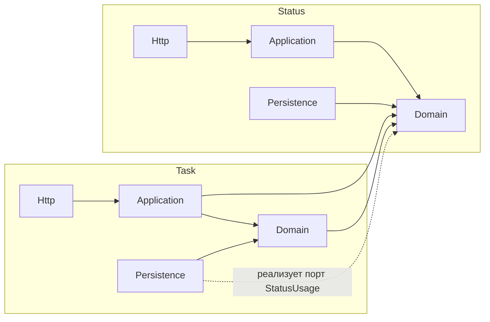
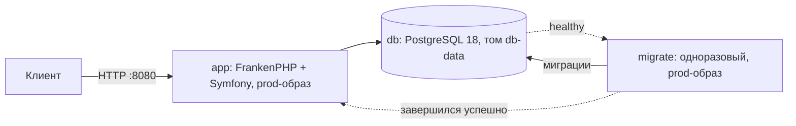

# Архитектура

Как устроено приложение и почему. Разделы и их номера — по шаблону arc42 (стандартный шаблон описания
архитектуры), урезанному по решению [11](../pre-init/11-architecture-design.md): раздел без содержания не
создаётся, поэтому номера идут с пропусками. Сами решения живут в ADR, здесь — обзор со ссылками.

## 1. Цели качества

Сценарии качества с измеримыми мерами — капабилити `quality`
([спека](../../openspec/specs/quality/spec.md)):

| Цель | Сценарии |
|---|---|
| Поднимается у проверяющего одной командой и готово к прод-запуску | `QAS-DEPLOY-clean-clone-start`, `QAS-DEPLOY-prod-image` |
| Сопровождаемость | `QAS-MAINT-layering`, `QAS-MAINT-typing`, `QAS-MAINT-readability`, `QAS-MAINT-readme-matches-code` |

## 2. Ограничения

Внешние ограничения — в [docs/constraints.md](../constraints.md) (`CON-…`), здесь не повторяются.

## 4. Стратегия решения

| Технология | Зачем | Решение |
|---|---|---|
| PHP 8.4, Symfony 8.1 | язык и фреймворк | [ADR-0001](../adr/ADR-0001-platform-versions.md) |
| PostgreSQL 18 | хранение | [ADR-0001](../adr/ADR-0001-platform-versions.md) |
| FrankenPHP (без worker mode), Docker Compose | запуск, образы `prod` и `dev` | [ADR-0002](../adr/ADR-0002-php-runtime.md) |
| NelmioApiDocBundle, OpenAPI 3.0 | контракт API из кода, Swagger UI на `/api/doc` | [ADR-0003](../adr/ADR-0003-api-contract.md) |
| Doctrine ORM 3, Doctrine Migrations, XML-мэппинг | хранение и схема | [ADR-0004](../adr/ADR-0004-orm.md) |
| Symfony Validator, `#[MapRequestPayload]` | валидация ввода, коды ошибок | [ADR-0005](../adr/ADR-0005-validation.md) |
| Слайсы на гексагональном ядре, модули Task и Status | структура кода | [ADR-0006](../adr/ADR-0006-module-structure.md) |

## 5. Строительные блоки

Два модуля, в каждом — гексагональное ядро и слайсы по сценариям ([ADR-0006](../adr/ADR-0006-module-structure.md)).
Гексагональное ядро — домен без зависимостей от фреймворка; внешний мир подключается через порты
(интерфейсы, которые объявляет домен) и адаптеры (их реализации: HTTP, база данных). Слайс — папка на
один сценарий (например, «создать задачу») с его командой и обработчиком.

*Диаграмма показывает разрешённые направления зависимостей; их проверяет Deptrac — анализатор
зависимостей между слоями ([deptrac.yaml](../../deptrac.yaml), `make deptrac`, в CI): Task может зависеть от домена Status,
Status от Task — нет; цикл «удалить статус → есть ли задачи» разорван портом `StatusUsage`. HTTP-слой
обращается к домену только за исключениями и значениями; сценарии вызывает через Application.*

| Слой | Ответственность |
|---|---|
| `Domain` | сущности, value objects, доменные исключения, порты (интерфейсы репозиториев); только PHP |
| `Application` | один слайс на сценарий: команда или запрос + обработчик |
| `Http` | контроллер слайса и DTO запроса: разбор и валидация ввода, коды ответов |
| `Persistence` | адаптеры Doctrine для портов, XML-мэппинг, генерация UUID v7 |

## 7. Развёртывание

*Диаграмма показывает порядок запуска по `docker compose up -d`: база → миграции → приложение
([ADR-0002](../adr/ADR-0002-php-runtime.md)).*

- Один образ на две цели: `prod` (его запускает проверяющий, без dev-зависимостей, отладка выключена) и
  `dev` (для разработки и инструментов, `compose.dev.yaml`).
- Настройки — только переменные окружения; обязательные (`DATABASE_URL`, `APP_SECRET`) проверяет
  entrypoint до старта PHP; несекретные значения для разработки — в `compose.yaml`, переопределяются
  через `.env`, который читает Docker Compose, а не приложение ([.env.example](../../.env.example)).
- Образ приложения собирается локально; базовые образы (FrankenPHP, PostgreSQL) закреплены по digest и
  доступны для amd64 и arm64.

## 8. Сквозные концепции

- **Ошибки и валидация.** Формат ошибок — по умолчанию Symfony: тело по RFC 9457 (`type`, `title`,
  `status`, `detail`, `violations`), заголовок `Content-Type: application/json`; коды —
  таблица в [ADR-0005](../adr/ADR-0005-validation.md); доменные исключения сопоставляются с кодами через
  `framework.exceptions` в конфигурации, домен не зависит от Symfony.
- **Транзакции.** Запись идёт через методы портов `save()` / `remove()`; адаптер вызывает `flush()`
  ([ADR-0006](../adr/ADR-0006-module-structure.md)).
- **Идентификаторы.** UUID v7 выдаёт адаптер хранения через `nextId()`.
- **Безопасность.** Применимые требования OWASP ASVS 5.0.0 уровня 1, чем они закрыты, принятые риски
  (нет авторизации и TLS) и политика уязвимых зависимостей — [asvs-l1.md](asvs-l1.md). На всех ответах —
  заголовок `X-Content-Type-Options: nosniff` (Caddy).
- **Конфигурация.** Только переменные окружения; Symfony не читает `.env` (его читает только Docker
  Compose) ([решение 15](../pre-init/15-agent-security.md)).
- **Стиль кода.** Стандарт Symfony (PER-CS 3.0 и правила Symfony) плюс небезопасные модернизации,
  синтаксис PHP 8.4 и обязательный `declare(strict_types=1)` — в конфигурации PHP-CS-Fixer; то, что
  конфигом не выразить (сообщения исключений, имена, PHPDoc, DI, конфигурация), — правила
  `RUL-CODE-…` в `.claude/rules/code.md`.

## 9. Отступления от Symfony Best Practices

Рекомендации Symfony (<https://symfony.com/doc/current/best_practices.html>), от которых проект отходит
сознательно; причина — в решении по ссылке.

| Рекомендация Symfony | Что в проекте | Почему |
|---|---|---|
| Маппинг Doctrine атрибутами на сущностях | XML-мэппинг в `Infrastructure/Persistence` | домен не зависит от Doctrine — [ADR-0004](../adr/ADR-0004-orm.md), [ADR-0006](../adr/ADR-0006-module-structure.md) |
| Структура каталогов по умолчанию (`src/Entity`, `src/Controller`) | модули Task и Status, внутри — `Domain`, `Application`, `Infrastructure` | ядро без фреймворка, слайс на сценарий — [ADR-0006](../adr/ADR-0006-module-structure.md) |
| Резолверы сущностей (`#[MapEntity]`) — сущность прямо в аргументе контроллера | контроллер получает DTO и вызывает обработчик сценария | HTTP-слой не обращается к базе — `QAS-MAINT-layering`, [ADR-0006](../adr/ADR-0006-module-structure.md); ответ строится из модели чтения — `RUL-SEC-response-models` |
| Суффикс `Interface` у интерфейсов (стандарт для контрибьюторов Symfony) | порты без суффикса: `StatusRepository`, `StatusUsage` | порт называется по роли в домене — [ADR-0006](../adr/ADR-0006-module-structure.md), `RUL-CODE-naming` |

Наследовать ли контроллеры от `AbstractController`, решается с первым эндпоинтом (изменение
`status-catalog`).
